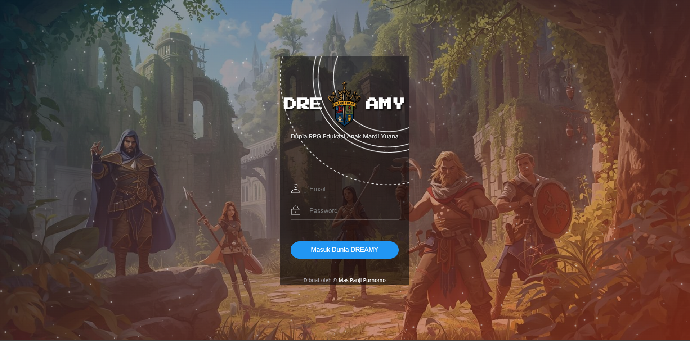

# 🏰 DREAMY: Chronicles of Mardi Yuana (v2.0)
> *Dunia RPG Edukasi Anak Mardi Yuana - Di mana Koding Bertemu Sihir!*

## 📜 Prolog: Apa itu DREAMY?
Selamat datang di **DREAMY**, sebuah ekosistem pembelajaran gamifikasi revolusioner yang mengubah ruang kelas SMK Mardi Yuana Cikembar menjadi dunia fantasi "Aethelgard". Di sini, tugas bukan lagi beban, melainkan *Quest*. Ujian bukan lagi momok, melainkan *Boss Battle*.

Dunia ini diciptakan oleh **Grand Archmage Mas Panji Purnomo** (Guru & Dungeon Master), dibantu oleh asisten setianya, **Inem** (AI Assistant), untuk membangkitkan *jiwa petualang* dalam diri setiap siswa.

---

## 🚀 The Chronicles: Update Terbaru (Apa yang Baru?)
Dunia DREAMY terus berkembang! Berikut adalah fitur-fitur mutakhir yang baru saja ditambahkan ke dalam *Source Code* kehidupan:

### 1. 🗺️ Peta Pelacak "Marauder's Map" (Leaflet JS)
DM sekarang memiliki mata dewa! Dengan integrasi **Leaflet.js**, lokasi fisik para siswa (berdasarkan GPS HP mereka) dapat dipantau secara *real-time* di Dashboard Admin.
* **Fungsi:** Memastikan siswa tidak bolos ke kantin saat jam pelajaran (atau terjebak di dungeon lain).
* **Fitur:** *Marker* dinamis dengan foto profil siswa.

### 2. 🕹️ Visual Dungeon 2D (Mini-Game Integration)
Kami tidak lagi hanya bermain di imajinasi teks! DREAMY kini memiliki **Pixel Art Dungeon Explorer**.
* Siswa dapat menggerakkan karakter 2D mereka menelusuri labirin.
* Menemukan peti harta karun (Reward Koin/XP).
* Bertemu monster visual yang harus dikalahkan dengan menjawab soal.

### 3. 🧠 Otak Baru Ivy (Customizable AI Persona)
Ivy si Roh Pot Bunga kini lebih pintar (dan lebih *julid*)!
* **Ivy Settings Panel:** DM bisa mengatur *System Prompt* Ivy sesuka hati. Mau Ivy yang ramah, atau Ivy yang galak dan suka ngegas pakai Bahasa Sunda? Semua bisa diatur di panel admin.
* **Koneksi Gemini API:** Otak Ivy ditenagai langsung oleh sihir kuno Google Gemini Flash 1.5.

### 4. ⚔️ Arena Pertarungan Baru: "Acak Kata"
Monster baru telah muncul! Selain menjawab kuis pilihan ganda, siswa kini bisa menantang **Monster Acak Kata**.
* **Gameplay:** Menebak istilah pemrograman yang hurufnya diacak dalam batas waktu tertentu.
* **Sanksi:** Jika waktu habis, HP berkurang drastis!

### 5. 💬 Merpati Pos Ajaib (Sistem Chat Real-time)
Interaksi sosial antar penghuni Aethelgard kini tanpa batas.
* **Admin-to-Student:** Guru bisa mengirim pesan peringatan atau petunjuk rahasia.
* **Student-to-Student:** Fitur chat antar teman (terbuka di Level tertentu) untuk koordinasi Guild.

---

## 👥 Para Penghuni & Peran

### Sang Pencipta & Penguasa
* **Dungeon Master (Mas Panji):** Pemegang kendali penuh. Bisa memanggil hujan meteor (Hukuman Massal) atau membagikan emas (Reward).
* **Inem (The System):** Asisten setia yang menjaga *backend* tetap stabil dan mengingatkan DM kalau mulai *halu*.

### Para NPC Pembangun (Tech Stack)
* **HTML sang Arsitek:** Membangun fondasi kastil dan *layout*.
* **Tailwind CSS sang Penjahit:** Memberikan jubah indah dan tampilan *responsive* yang memukau.
* **JavaScript (Vanilla & Modules) sang Penyihir Kehidupan:** Menggerakkan logika, perhitungan *damage*, dan animasi.
* **Firebase sang Penjaga Arsip:** Database *real-time* yang mencatat setiap nyawa (HP), harta (Koin), dan dosa (Log Aktivitas) siswa.

### Pahlawan (Siswa)
Para siswa memilih takdir mereka:
* 🛡️ **Prajurit:** Tangguh, HP tebal, pelindung teman.
* ✨ **Penyihir:** *Damage* besar, bisa memberikan *Buff* serangan ke satu kelas.
* 🌿 **Penyembuh:** Sang penyelamat yang bisa memulihkan HP teman yang sekarat karena tugas.

---

## 🔮 Grimoire (Fitur Utama)

### 1. Sistem Ekonomi & Item
* **Toko Sihir:** Jual beli item penyembuh, *scroll* pengalaman, atau *prank* (seperti "Kutukan Kentut" - *Coming Soon*).
* **Inventori Guild:** Peti bersama untuk menyimpan hasil *raid*.

### 2. Magic Controls (Panel Admin)
Panel khusus di mana DM bisa merapal mantra instan:
* **Buff:** Beri *Shield*, *Attack Up*, atau *Key Item*.
* **Curse:** Berikan status *Racun* (HP berkurang tiap jam) atau *Silence* (Tidak bisa chat/jawab soal).
* **Noise Detector:** Mantra area yang mendeteksi kebisingan kelas via mikrofon. Jika terlalu berisik > HP satu kelas berkurang otomatis!

### 3. Gerbang Dimensi (Presensi)
* **QR Code Scanner:** Siswa memindai kode magis untuk mencatat kehadiran dan mendapatkan *Daily Login Bonus*.

---

## 🔜 Vision: The Future of DREAMY
Rencana pengembangan selanjutnya oleh Mas Panji:
* **Halaman Guru (The Mentor's Hall):** Memberikan akses kepada guru mata pelajaran lain untuk menjadi "Quest Giver".

---

> *"Coding is not just about typing; it's about casting spells to create a new world."* - Mas Panji Purnomo
